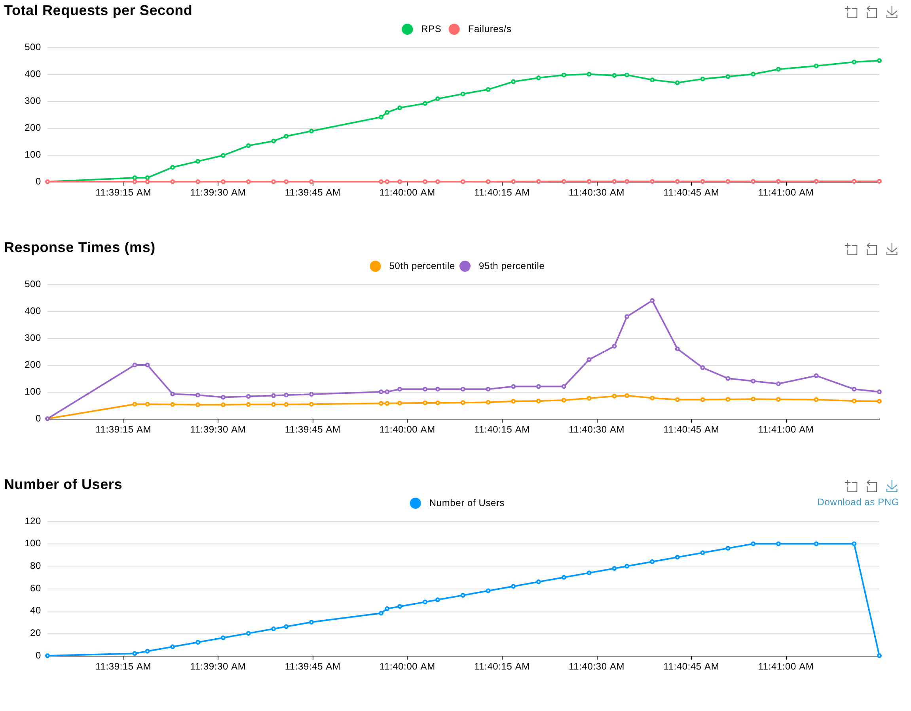
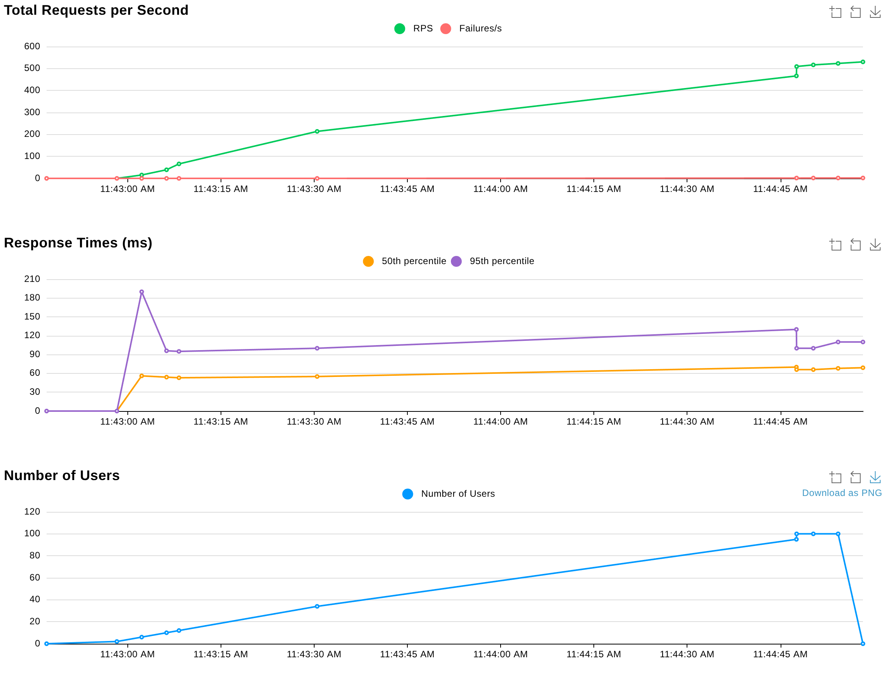
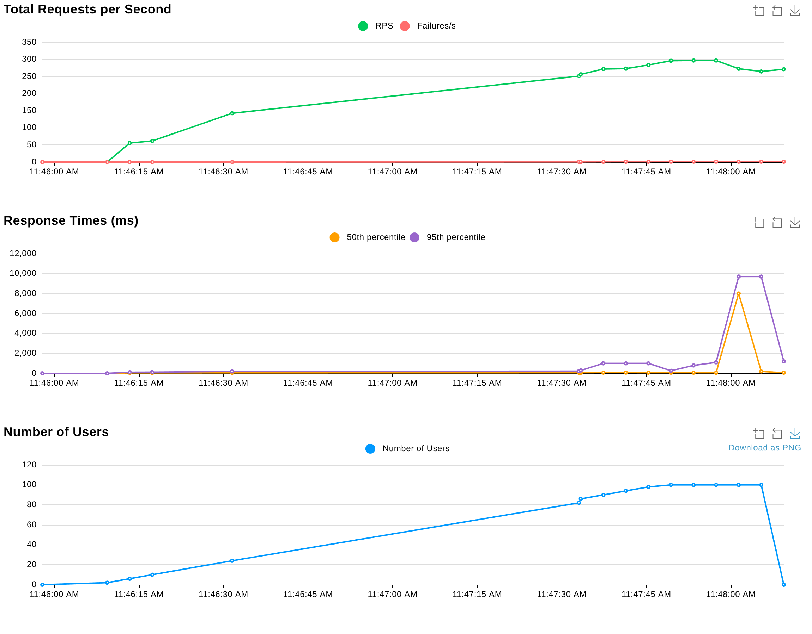
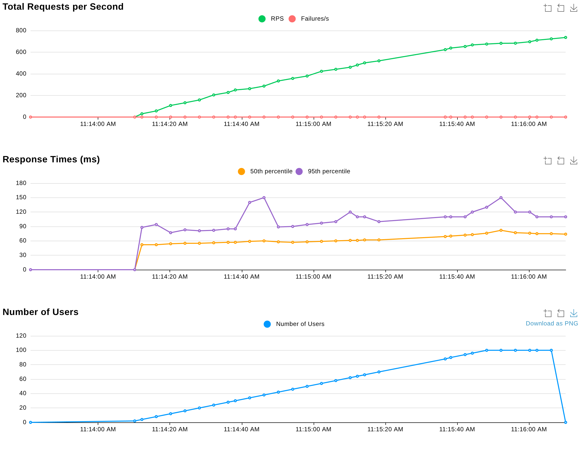
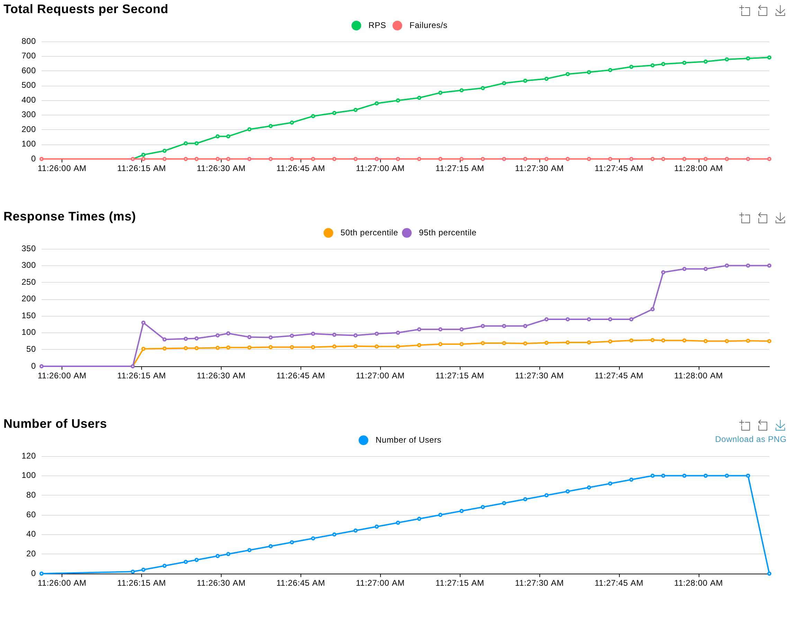
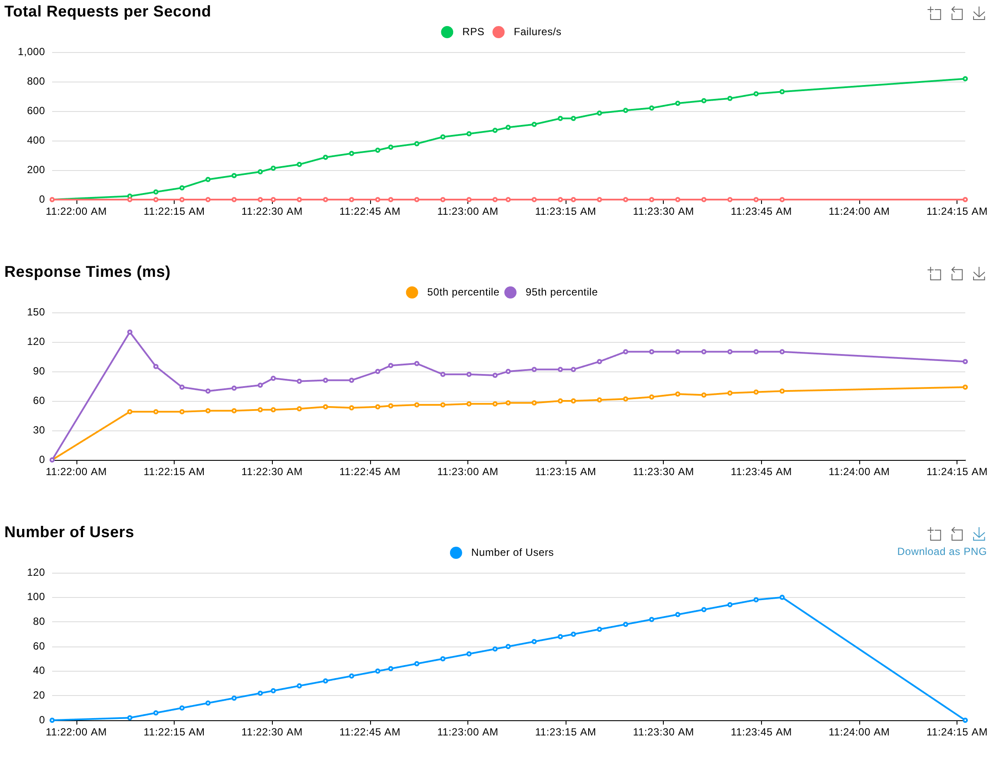

# Locust

[Locust](https://docs.locust.io/) is a load testing framework.

## Quick Setup

Setup the endpoints you want to test on the [locustfile.py](locustfile.py).

You will need `docker` and `docker-compose` installed in your system, in order to run this infrastructure. 

Type:

```
docker compose up
```

Or, if you want to run it in the background

```
docker compose up -d
```

Access the UI at [http://localhost:8089/](http://localhost:8089/) and run your tests.

Some result tests can be found [here](./report_1725036621.259672.html). You can preview them [here](https://doublebyte1.github.io/locust/report_1725036621.259672.html).

## Reports

Some runs were created for different test cases (more details bellow). Each run considered a __maximum of 100 users, spawning 1 user per second, during a period of 2 minutes__. 

The results can be found in the following folders:

* [Test Case 1](./tc1/)
* [Test Case 2](./tc2/)
* [Test Case 3](./tc3/)
* [Test Case 4](./tc4/)
* [Test Case 5](./tc5/)
* [Test Case 6](./tc6/)

### Test Case 1 (tc1)

This run tests an OGC API - Maps endpoint on the production server:

* [https://ogcapi.dgterritorio.gov.pt/collections/cosc2018](https://ogcapi.dgterritorio.gov.pt/collections/cosc2018)
  


### Test Case 2 (tc2)

This run tests an OGC API - Features endpoint on the production server:

* [https://ogcapi.dgterritorio.gov.pt/collections/srup_arvores_point](https://ogcapi.dgterritorio.gov.pt/collections/srup_arvores_point)



### Test Case 3 (tc3)

This run tests an OGC API - Tiles endpoint on the production server:

* [https://ogcapi.dgterritorio.gov.pt/collections/srup_arvores_point/tiles](https://ogcapi.dgterritorio.gov.pt/collections/srup_arvores_point/tiles)



### Test Case 4 (tc4)

This run tests an OGC API - Maps endpoint on the kubernetes server:

* [https://k8.byteroad.net/collections/cosc2018](https://k8.byteroad.net/collections/cosc2018)



### Test Case 5 (tc5)

This run tests an OGC API - Features endpoint on the kubernetes server:

* [https://k8.byteroad.net/collections/srup_arvores_point](https://k8.byteroad.net/collections/srup_arvores_point)



### Test Case 6 (tc6)

This run tests an OGC API - Tiles endpoint on the kubernetes server:

* [https://k8.byteroad.net/collections/srup_arvores_point/tiles](https://k8.byteroad.net/collections/srup_arvores_point/tiles)



## License

This project is released under an [MIT License](./LICENSE)

[](https://opensource.org/licenses/MIT)